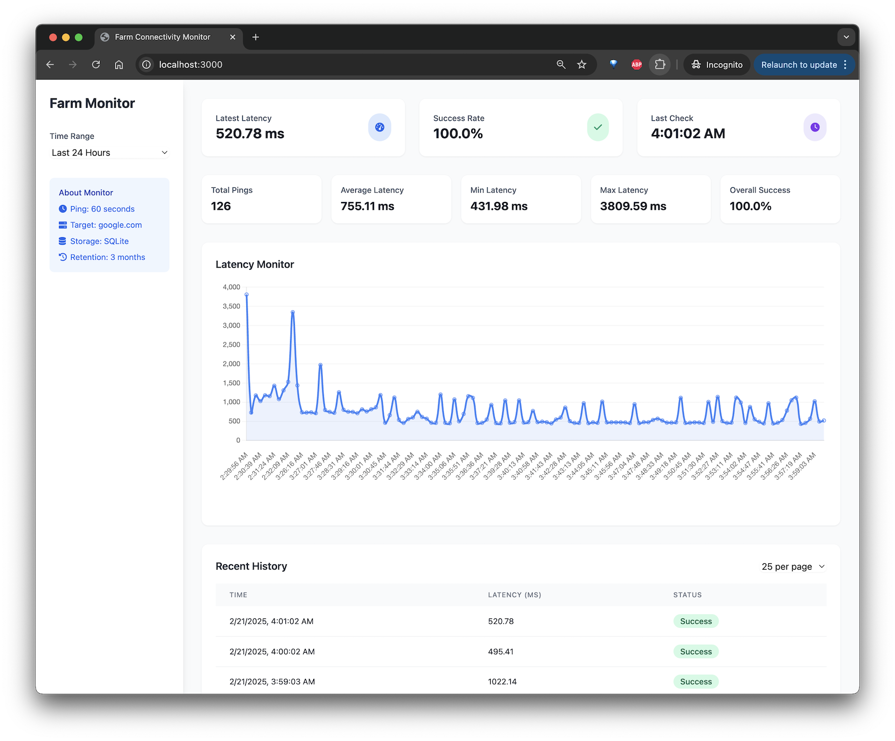

# Farm Connectivity Monitor

A simple and high performance web application written in Go language for monitoring internet connectivity in my farm by pinging Google's servers every 60 seconds. This application helps track network performance and identify potential connectivity issues with near towers in the area.


*Farm Connectivity Monitor Dashboard*

### Why choosing Go over other languages such Java, Python, Node.js, etc.?
I chosed it spacifically for this project because it will be deployed on a Raspberry Pi 5 with limited resources. Go is a very light language and it will be very easy to deploy and scale.

Also, go fiber framework is a very light and fast framework for building web applications compared to other frameworks like FastAPI, Spring Boot, etc.

### Why pinging Google's servers?
I am pinging Google's servers because they are a reliable and fast server. Also, they are a good representative of the internet connectivity in the area.

## Features

- Real-time monitoring of internet connectivity
- Beautiful, responsive dashboard built with TailwindCSS
- Interactive latency graph using Chart.js
- Historical data tracking with SQLite database
- Docker support for easy deployment

## Requirements

- Go 1.21 or higher (for local development)
- Docker and Docker Compose (for containerized deployment)

## Local Development

1. Clone the repository:
```bash
git clone https://github.com/cs4alhaider/farm-connectivity
cd farm-connectivity
```

2. Install dependencies:
```bash
go mod download
```

3. Run the application:
```bash
go run main.go
```

The application will be available at `http://localhost:3000`

## Docker Deployment

1. Build and start the container:
```bash
docker-compose up -d
```

The application will be available at `http://localhost:3000`

## Architecture

- **Backend**: Go with Fiber framework
- **Database**: SQLite3 for data persistence
- **Frontend**: HTML with TailwindCSS and Chart.js
- **Monitoring**: Automated ping checks every 15 seconds

## Data Storage

The application stores ping results in a SQLite database with the following information:
- Timestamp
- Latency (in milliseconds)
- Success status

The database file is persisted using Docker volumes, ensuring data is retained between container restarts.

## Monitoring Dashboard

The dashboard provides:
- Current connectivity status
- Latest latency measurements
- Success rate
- Interactive graph of historical latency
- Detailed history table with timestamps and status

## License

MIT License 